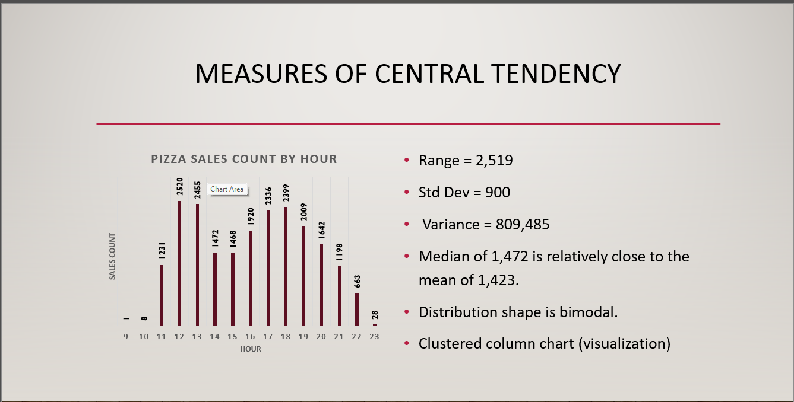
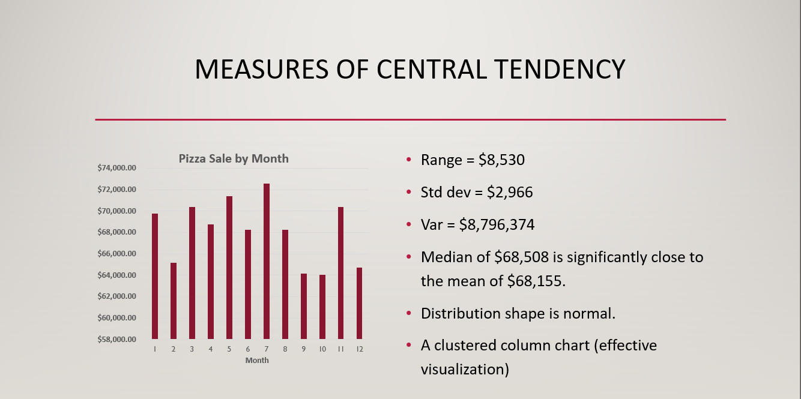
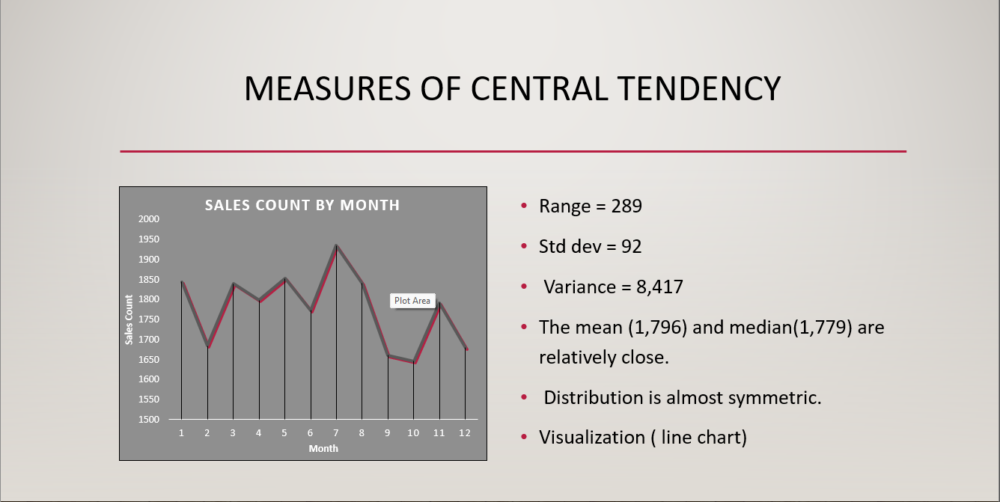
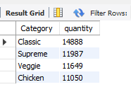

# PIZZA SALES DATA ANALYSIS

 You can view the full report here
 

## Project Overview

This project focuses on analyzing pizza sales data using data analytics and statistical methods. 
The goal is to uncover trends and insights within the dataset through careful exploration, data cleanup, statistical analysis, and hypothesis testing. 
The final analysis is presented in a structured and visual format to effectively communicate the findings.

### Introduction
This project involves the analysis of pizza sales data, aiming to explore the data, perform necessary cleaning, and apply statistical techniques
to derive meaningful insights. The project culminates in a comprehensive presentation that tells the story of the data through visualizations and statistical findings.

### DataSet
The dataset used in this project is titled “Pizza Sales.” It includes various fields related to pizza sales, such as order details, sales figures, and customer demographics.
The data is available in CSV format.

- **Data Viewing**: The data was initially explored using Excel to understand its structure and content.
- **Data Dictionary Review**: A thorough review of the data dictionary was conducted to understand the meaning of each field.
- **Impressions**: Initial impressions of the data included observations about the types of data available and potential areas for analysis.

### Data Cleanup
While the dataset is well-structured, additional data cleanup was performed to ensure accuracy and consistency.
This included handling missing values, correcting data types, and other necessary preprocessing steps.

### Statistical Analysis
- **Central Tendency**: Measures of central tendency, such as mean, median, and mode, were calculated to summarize key aspects of the data.
- **Statistical Distributions**: Various distributions were analyzed to understand the spread and variability of the data.
- **Visualizations**: Visual representations such as bar charts were created to illustrate the data distributions as follows:

  

   

  **Insights**
  - **Peak Sales Hour**: The highest sales count at 12 PM highlights that this time represents a key period of customer activity, likely coinciding with lunchtime.
  - This makes it a critical time for maximizing sales opportunities.
 
  **Recommendations**
  
  - **Lunchtime Promotions**: To capitalize on the high sales count at 12 PM, consider implementing lunchtime promotions or special deals.
  This could include discounts on combo meals, loyalty rewards, or limited-time offers specifically targeted for the noon hour.
  - **Optimize Staffing and Operations**: Given the peak in sales at 12 PM, ensure that staffing levels and operations are optimized to handle the increased customer demand efficiently. 
This includes having enough staff to manage orders and ensuring quick service to enhance customer satisfaction during the busiest hour

  

  

     **Insights**
  - **Highest Sales Count in July**: The highest number of sales in July indicates a strong demand for pizza during the summer, which might be influenced by
    various factors like school vacations, holidays, or outdoor gatherings.
  - **Lowest Sales Count in October**: The drop in sales count in October suggests that this month experiences the least demand, potentially due to factors
    like the start of the school year, changing weather, or other seasonal shifts.
 
     **Recommendations**
  - **Maximize July Sales**: Since July has the highest sales count, consider ramping up marketing efforts, offering special deals, and organizing events to
    take full advantage of the high demand during this month.
  - **Boost October Sales**: To counter the lower sales count in October, you might introduce targeted promotions, such as fall-themed deals or discounts.
    Engaging customers with limited-time offers or themed products could help increase sales during this quieter period

### Hypothesis Testing 
- **Hypotheses**: A null hypothesis and an alternate hypothesis were formulated regarding pizza sales trends.
- **Statistical Tests**: Appropriate statistical tests were conducted to evaluate the hypotheses.
- **Results**: Based on the test results, decisions were made to either reject or fail to reject the null hypothesis.

### Further Analyis using SQL

### Results and Presentation
The overall analysis was compiled into a presentation, utilizing slides and visualizations. 
The findings were presented in a story format, detailing the decisions made during the analysis and the implications of the results.

### Conclusion
The project concludes with a summary of the key insights derived from the analysis. These insights could be used to inform business decisions related to pizza sales.

