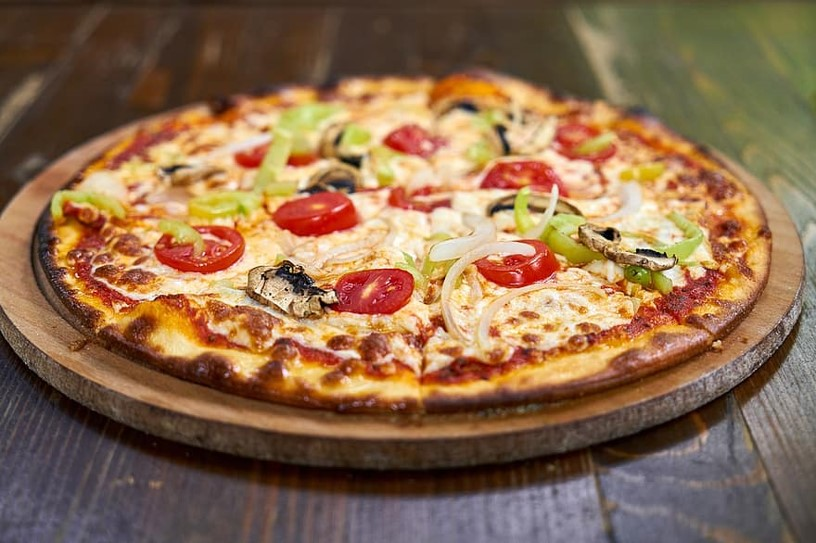

# PIZZA SALES DATA ANALYSIS

 You can view the full report here
 

## Project Overview

This project focuses on analyzing pizza sales data using data analytics and statistical methods. 
The goal is to uncover trends and insights within the dataset through careful exploration, data cleanup, statistical analysis, and hypothesis testing. 
The final analysis is presented in a structured and visual format to effectively communicate the findings.

### Introduction
This project involves the analysis of pizza sales data, aiming to explore the data, perform necessary cleaning, and apply statistical techniques
to derive meaningful insights. The project culminates in a comprehensive presentation that tells the story of the data through visualizations and statistical findings.

### DataSet
The dataset used in this project is titled “Pizza Sales.” It includes various fields related to pizza sales, such as order details, sales figures, and customer demographics.
The data is available in CSV format.

- **Data Viewing**: The data was initially explored using Excel to understand its structure and content.
- **Data Dictionary Review**: A thorough review of the data dictionary was conducted to understand the meaning of each field.
- **Impressions**: Initial impressions of the data included observations about the types of data available and potential areas for analysis.

### Data Cleanup
While the dataset is well-structured, additional data cleanup was performed to ensure accuracy and consistency.
This included handling missing values, correcting data types, and other necessary preprocessing steps.

### Statistical Analysis
- **Central Tendency**: Measures of central tendency, such as mean, median, and mode, were calculated to summarize key aspects of the data.
- **Statistical Distributions**: Various distributions were analyzed to understand the spread and variability of the data.
- **Visualizations**: Visual representations such as histograms, box plots, and bar charts were created to illustrate the data distributions.

### Hypothesis Testing 
-**Hypotheses**: A null hypothesis and an alternate hypothesis were formulated regarding pizza sales trends.
- **Statistical Tests**: Appropriate statistical tests were conducted to evaluate the hypotheses.
- **Results**: Based on the test results, decisions were made to either reject or fail to reject the null hypothesis.
  
### Results and Presentation
The overall analysis was compiled into a presentation, utilizing slides and visualizations. 
The findings were presented in a story format, detailing the decisions made during the analysis and the implications of the results.

### Conclusion
The project concludes with a summary of the key insights derived from the analysis. These insights could be used to inform business decisions related to pizza sales.

